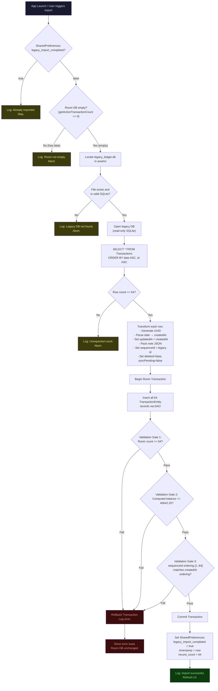

# Phase 2B.2 — Legacy Database Import Engine Blueprint

> Architecture validation document.  
> Branch: `feature/legacy-db-import`  
> Date: 2026-06-10  
> Status: **Design — No code changes.**

---

## Table of Contents

1. [Legacy Database Discovery](#1-legacy-database-discovery)
2. [Legacy → Room Mapping Table](#2-legacy--room-mapping-table)
3. [sequenceId Population Strategy](#3-sequenceid-population-strategy)
4. [UUID Generation Strategy](#4-uuid-generation-strategy)
5. [createdAt Conversion Strategy](#5-createdat-conversion-strategy)
6. [updatedAt Strategy](#6-updatedat-strategy)
7. [Ordering Preservation Strategy](#7-ordering-preservation-strategy)
8. [Running Balance Preservation Strategy](#8-running-balance-preservation-strategy)
9. [Validation Strategy](#9-validation-strategy)
10. [Rollback Strategy](#10-rollback-strategy)
11. [Re-Import Prevention Strategy](#11-re-import-prevention-strategy)
12. [Backup/Retention Compatibility Analysis](#12-backupretention-compatibility-analysis)
13. [Migration Execution Flow Diagram](#13-migration-execution-flow-diagram)
14. [Risks and Edge Cases](#14-risks-and-edge-cases)
15. [Phase 2B.3 Implementation Plan](#15-phase-2b3-implementation-plan)

---

## 1. Legacy Database Discovery

### 1.1 Database Location

The legacy database is a SQLite file managed by the Ktor backend server.

| Property | Value |
|----------|-------|
| **Database engine** | SQLite (via JDBC `org.sqlite.JDBC`) |
| **Filename** | `ledger.db` |
| **Canonical path** | `<repo>/backend/backend/data/ledger.db` |
| **Path resolution** | [`StoragePaths.kt`](file:///C:/Users/Lenovo/.gemini/antigravity/worktrees/ExpenseTracker/fix-branch-visibility-issue/backend/src/main/kotlin/com/household/ledger/storage/StoragePaths.kt#L19-L21) — `File(dataDir, "ledger.db")` |
| **WAL mode** | Enabled via `PRAGMA journal_mode=WAL` in [`DatabaseFactory.kt`](file:///C:/Users/Lenovo/.gemini/antigravity/worktrees/ExpenseTracker/fix-branch-visibility-issue/backend/src/main/kotlin/com/household/ledger/database/DatabaseFactory.kt#L24-L28) |
| **ORM** | Jetbrains Exposed |
| **Known record count** | **64 transactions** |
| **Known final balance** | **₹40,642.25** |

> [!IMPORTANT]
> The legacy database file resides on the developer's desktop machine at the repo-relative path `backend/backend/data/ledger.db`. For the Android import, this file must be **shipped as a bundled asset** (`app/src/main/assets/legacy_ledger.db`) or placed on the device via ADB/file manager. The import engine must NOT assume network connectivity to the Ktor backend.

### 1.2 Companion Files (Backup System)

| File | Path | Purpose |
|------|------|---------|
| `backup_meta.json` | `backend/backend/data/backups/backup_meta.json` | Mutation counter, last backup time, auto/manual counts |
| `backup_history.json` | `backend/backend/data/backups/backup_history.json` | Chronological list of all backup snapshots |
| `*.db` backups | `backend/backend/data/backups/` | Physical SQLite snapshot files |

### 1.3 Legacy Table Schema

Source: [`DatabaseFactory.kt`](file:///C:/Users/Lenovo/.gemini/antigravity/worktrees/ExpenseTracker/fix-branch-visibility-issue/backend/src/main/kotlin/com/household/ledger/database/DatabaseFactory.kt#L50-L62)

```sql
CREATE TABLE IF NOT EXISTS Transactions (
    id           INTEGER PRIMARY KEY AUTOINCREMENT,
    date         VARCHAR(50)       NOT NULL,
    entry_type   VARCHAR(20)       NOT NULL,
    amount       DECIMAL(20,4)     NOT NULL,
    category     VARCHAR(100)      NOT NULL,
    expense_type VARCHAR(100)      NOT NULL,
    paid_to      VARCHAR(100)      NOT NULL,
    notes        TEXT              NOT NULL,
    balance_after DECIMAL(20,4)    NOT NULL
);
```

### 1.4 Legacy Field Details

| Column | Exposed Type | SQLite Type | Example Value | Notes |
|--------|-------------|-------------|---------------|-------|
| `id` | `integer().autoIncrement()` | `INTEGER PRIMARY KEY` | `1`, `2`, ... `64` | Monotonically increasing, contiguous |
| `date` | `varchar(50)` | `VARCHAR(50)` | `"2025-01-15"` | Format: `yyyy-MM-dd` (string, NOT epoch) |
| `entry_type` | `varchar(20)` | `VARCHAR(20)` | `"Credit"` or `"Debit"` | Maps to Room `type` |
| `amount` | `decimal(20,4)` | `DECIMAL(20,4)` | `5000.0000` | 4 decimal places in storage |
| `category` | `varchar(100)` | `VARCHAR(100)` | `"Groceries"` | Direct map |
| `expense_type` | `varchar(100)` | `VARCHAR(100)` | `"Cash"`, `"UPI"` | Packed into Room `note` JSON |
| `paid_to` | `varchar(100)` | `VARCHAR(100)` | `"Big Bazaar"` | Packed into Room `note` JSON |
| `notes` | `text` | `TEXT` | `"Monthly groceries"` | Packed into Room `note` JSON |
| `balance_after` | `decimal(20,4)` | `DECIMAL(20,4)` | `40642.2500` | Running balance (pre-computed) |

### 1.5 Legacy Ordering Evidence

Source: [`TransactionService.kt`](file:///C:/Users/Lenovo/.gemini/antigravity/worktrees/ExpenseTracker/fix-branch-visibility-issue/backend/src/main/kotlin/com/household/ledger/database/TransactionService.kt)

| Context | ORDER BY Clause | Source Line |
|---------|----------------|-------------|
| Display (newest first) | `date DESC, id DESC` | [L17](file:///C:/Users/Lenovo/.gemini/antigravity/worktrees/ExpenseTracker/fix-branch-visibility-issue/backend/src/main/kotlin/com/household/ledger/database/TransactionService.kt#L17) |
| Pagination (newest first) | `date DESC, id DESC` | [L24](file:///C:/Users/Lenovo/.gemini/antigravity/worktrees/ExpenseTracker/fix-branch-visibility-issue/backend/src/main/kotlin/com/household/ledger/database/TransactionService.kt#L24) |
| Balance recalculation (oldest first) | `date ASC, id ASC` | [L130](file:///C:/Users/Lenovo/.gemini/antigravity/worktrees/ExpenseTracker/fix-branch-visibility-issue/backend/src/main/kotlin/com/household/ledger/database/TransactionService.kt#L130) |
| Overview first/last row | `date ASC/DESC, id ASC/DESC` | [L57-L58](file:///C:/Users/Lenovo/.gemini/antigravity/worktrees/ExpenseTracker/fix-branch-visibility-issue/backend/src/main/kotlin/com/household/ledger/database/TransactionService.kt#L57-L58) |

---

## 2. Legacy → Room Mapping Table

### 2.1 Current Room Schema

Source: [`TransactionEntity.kt`](file:///C:/Users/Lenovo/.gemini/antigravity/worktrees/ExpenseTracker/fix-branch-visibility-issue/app/src/main/java/com/example/expensetracker/local/TransactionEntity.kt)

```kotlin
@Entity(tableName = "transactions", indices = [Index("sequenceId")])
data class TransactionEntity(
    @PrimaryKey val id: String,        // UUID string
    val amount: Double,
    val type: String,                   // "Credit" or "Debit"
    val category: String,
    val note: String,                   // JSON: {"notes":"...", "expenseType":"...", "paidTo":"..."}
    val createdAt: Long,               // Epoch millis
    val updatedAt: Long,               // Epoch millis
    val deleted: Boolean,
    val syncPending: Boolean,
    val sequenceId: Long = 0L          // Monotonic insertion order
)
```

### 2.2 Complete Field Mapping

| Legacy Column | Legacy Type | → | Room Field | Room Type | Transformation |
|--------------|-------------|---|------------|-----------|----------------|
| `id` | `INTEGER` | → | `sequenceId` | `Long` | Direct copy: legacy `id` → Room `sequenceId` |
| — | — | → | `id` | `String` | **Generate new UUID** (see §4) |
| `date` | `VARCHAR` | → | `createdAt` | `Long` | Parse `yyyy-MM-dd` → epoch millis at midnight (see §5) |
| `entry_type` | `VARCHAR` | → | `type` | `String` | Direct copy: `"Credit"` / `"Debit"` |
| `amount` | `DECIMAL(20,4)` | → | `amount` | `Double` | `BigDecimal` → `Double` (safe for ₹ amounts) |
| `category` | `VARCHAR` | → | `category` | `String` | Direct copy |
| `expense_type` | `VARCHAR` | → | `note` (JSON) | `String` | Pack into JSON `{"expenseType": "..."}` |
| `paid_to` | `VARCHAR` | → | `note` (JSON) | `String` | Pack into JSON `{"paidTo": "..."}` |
| `notes` | `TEXT` | → | `note` (JSON) | `String` | Pack into JSON `{"notes": "..."}` |
| `balance_after` | `DECIMAL(20,4)` | → | *(not stored)* | — | Used for **validation only** (see §9) |
| — | — | → | `updatedAt` | `Long` | Set to same value as `createdAt` (see §6) |
| — | — | → | `deleted` | `Boolean` | `false` for all imported records |
| — | — | → | `syncPending` | `Boolean` | `false` — imported data is canonical |

### 2.3 Note Field JSON Encoding

The Room `note` field stores a JSON object combining three legacy fields. This encoding is established by [`AndroidBridge.kt`](file:///C:/Users/Lenovo/.gemini/antigravity/worktrees/ExpenseTracker/fix-branch-visibility-issue/app/src/main/java/com/example/expensetracker/bridge/AndroidBridge.kt#L147-L150):

```json
{
    "notes": "<legacy.notes>",
    "expenseType": "<legacy.expense_type>",
    "paidTo": "<legacy.paid_to>"
}
```

---

## 3. sequenceId Population Strategy

### 3.1 Current Infrastructure

Source: [`LocalRepository.kt`](file:///C:/Users/Lenovo/.gemini/antigravity/worktrees/ExpenseTracker/fix-branch-visibility-issue/app/src/main/java/com/example/expensetracker/repository/LocalRepository.kt#L9-L20)

```kotlin
suspend fun insertTransaction(transaction: TransactionEntity) {
    val entityToInsert = if (transaction.sequenceId == 0L) {
        val maxSeq = transactionDao.getMaxSequenceId() ?: 0L
        transaction.copy(sequenceId = maxSeq + 1L)
    } else {
        transaction  // Preserve explicitly-set sequenceId
    }
    transactionDao.insertTransaction(entityToInsert)
}
```

### 3.2 Strategy

**Direct legacy `id` → Room `sequenceId` mapping.**

| Property | Value |
|----------|-------|
| Source | Legacy `id` (1..64, auto-increment) |
| Target | Room `sequenceId` |
| Range | 1 to 64 |
| Monotonicity | Guaranteed — legacy IDs are contiguous auto-increment |
| Gap handling | N/A — no gaps in auto-increment with no deletes |
| Future compatibility | New Room inserts use `MAX(sequenceId) + 1` → will start at 65+ |
| Bypass auto-assign | Set `sequenceId` explicitly to non-zero → `LocalRepository` preserves it |

> [!TIP]
> By directly mapping legacy `id` → `sequenceId`, we preserve the exact insertion order. The import engine **must set `sequenceId` explicitly** (non-zero) on each entity to bypass the auto-assign logic in `LocalRepository.insertTransaction()`.

### 3.3 Post-Import State

After import: `MAX(sequenceId) = 64`. Any new transaction added via the bridge will receive `sequenceId = 65`.

---

## 4. UUID Generation Strategy

### 4.1 Approach: Deterministic UUIDs

Use `UUID.nameUUIDFromBytes()` (UUID v5-style, deterministic) seeded from a fixed namespace + legacy `id`.

```
UUID = UUID.nameUUIDFromBytes("legacy-import:$legacyId".toByteArray())
```

### 4.2 Rationale

| Approach | Pros | Cons | Selected |
|----------|------|------|----------|
| Random UUIDs (`UUID.randomUUID()`) | Simple | Non-reproducible — re-import creates duplicates | ❌ |
| Deterministic UUIDs | Reproducible, idempotent re-import detection | Slight complexity | ✅ |
| Legacy ID as string (`"1"`, `"2"`) | Trivially simple | Collides with potential future numeric IDs | ❌ |
| Prefixed legacy ID (`"legacy-1"`) | Simple, readable | Not a valid UUID format — breaks assumptions | ❌ |

### 4.3 Properties

- **Deterministic**: Same legacy `id` always produces the same UUID.
- **Collision-safe**: UUID v3/v5 namespace prevents collision with `UUID.randomUUID()` v4 UUIDs used by the bridge.
- **Re-import detection**: If UUID already exists in Room, the record was already imported (see §11).

### 4.4 Implementation Detail

```kotlin
// Pseudo-code — not actual implementation
val legacyId = 42
val uuid = UUID.nameUUIDFromBytes("ExpenseTracker-legacy-import:$legacyId".toByteArray())
// → Always produces the same UUID for legacyId=42
```

---

## 5. createdAt Conversion Strategy

### 5.1 Legacy Date Format

Legacy `date` is stored as a **string** in `yyyy-MM-dd` format (e.g., `"2025-01-15"`).

### 5.2 Conversion Logic

```
createdAt = parseDateString("yyyy-MM-dd") → Calendar at midnight local timezone
           + offset from legacy id to preserve sub-day ordering
```

### 5.3 Sub-Day Ordering Problem

Multiple transactions may share the same date (e.g., 5 entries on `2025-03-10`). The legacy system resolves this with `ORDER BY date ASC, id ASC`. The Room DAO orders by `createdAt DESC, updatedAt DESC`.

**Solution**: Inject a millisecond offset derived from legacy `id` to create distinct `createdAt` values:

```
createdAt = midnight_epoch_of(date) + legacyId
```

| Legacy ID | Legacy Date | createdAt (epoch ms) |
|-----------|-------------|---------------------|
| 1 | 2025-01-01 | midnight(2025-01-01) + 1 |
| 2 | 2025-01-01 | midnight(2025-01-01) + 2 |
| 3 | 2025-01-02 | midnight(2025-01-02) + 3 |

**Why this works:**
- Same-date transactions: later `id` → later `createdAt` → preserved insertion order.
- Cross-date transactions: date component already differentiates.
- Offset magnitudes (1–64 ms) are negligible — they don't shift the calendar day.
- Room DAO `ORDER BY createdAt DESC` produces the exact reverse of legacy `ORDER BY date ASC, id ASC`.

> [!NOTE]
> The existing `AndroidBridge.parseDateToLong()` already uses `Thread.sleep(1)` to produce distinct millisecond timestamps for same-date entries. Our offset strategy is consistent with this design intent.

---

## 6. updatedAt Strategy

### 6.1 Approach

Set `updatedAt = createdAt` for all imported records.

### 6.2 Rationale

- Imported records have never been updated by the user.
- The Room DAO secondary sort is `updatedAt DESC` — setting it equal to `createdAt` means the secondary sort degenerates to the primary sort, preserving order.
- If a user later edits an imported record, `updatedAt` gets set to `System.currentTimeMillis()` by the bridge, naturally floating the edited record to the top of same-day entries. This is consistent with current behavior.

---

## 7. Ordering Preservation Strategy

### 7.1 Current Room DAO Ordering

Source: [`TransactionDao.kt`](file:///C:/Users/Lenovo/.gemini/antigravity/worktrees/ExpenseTracker/fix-branch-visibility-issue/app/src/main/java/com/example/expensetracker/local/TransactionDao.kt)

| Query | ORDER BY | Used For |
|-------|----------|----------|
| `getAllTransactions()` | `createdAt DESC, updatedAt DESC` | Display (newest first) |
| `getTransactionsByMonth()` | `createdAt DESC, updatedAt DESC` | Monthly filter |

### 7.2 Bridge Layer Ordering

Source: [`AndroidBridge.kt`](file:///C:/Users/Lenovo/.gemini/antigravity/worktrees/ExpenseTracker/fix-branch-visibility-issue/app/src/main/java/com/example/expensetracker/bridge/AndroidBridge.kt#L68-L69)

```kotlin
val entities = repository.getAllTransactions().first().filter { !it.deleted }
val sortedEntities = entities  // Uses DAO ordering: createdAt DESC, updatedAt DESC
```

### 7.3 Ordering Equivalence Proof

| Legacy | Room Equivalent | Equivalence |
|--------|----------------|-------------|
| `date ASC, id ASC` | `createdAt ASC` (with ID-offset) | ✅ `createdAt = midnight(date) + id` makes `createdAt ASC` ≡ `date ASC, id ASC` |
| `date DESC, id DESC` | `createdAt DESC` (with ID-offset) | ✅ Exact reverse of the above |

The bridge displays using `createdAt DESC, updatedAt DESC`. Since `updatedAt = createdAt` for imports, this reduces to `createdAt DESC`, which is equivalent to the legacy `date DESC, id DESC`.

### 7.4 Running Balance Calculation Ordering

Source: [`AndroidBridge.kt`](file:///C:/Users/Lenovo/.gemini/antigravity/worktrees/ExpenseTracker/fix-branch-visibility-issue/app/src/main/java/com/example/expensetracker/bridge/AndroidBridge.kt#L84)

```kotlin
val reversedEntities = sortedEntities.reversed()  // Reverses DESC → ASC for balance calculation
```

This produces `createdAt ASC` ordering for balance computation, which is equivalent to legacy `date ASC, id ASC` — the same ordering used by the legacy [`performRecalculation()`](file:///C:/Users/Lenovo/.gemini/antigravity/worktrees/ExpenseTracker/fix-branch-visibility-issue/backend/src/main/kotlin/com/household/ledger/database/TransactionService.kt#L130).

---

## 8. Running Balance Preservation Strategy

### 8.1 Legacy Balance System

Source: [`TransactionService.performRecalculation()`](file:///C:/Users/Lenovo/.gemini/antigravity/worktrees/ExpenseTracker/fix-branch-visibility-issue/backend/src/main/kotlin/com/household/ledger/database/TransactionService.kt#L128-L149)

The legacy system stores `balance_after` as a **pre-computed column** that is recalculated after every CRUD mutation:
```
Sort all records by date ASC, id ASC
currentBalance = 0
For each record:
    if Credit: currentBalance += amount
    if Debit:  currentBalance -= amount
    UPDATE record SET balance_after = currentBalance
```

### 8.2 Room Balance System

Source: [`AndroidBridge.getTransactions()`](file:///C:/Users/Lenovo/.gemini/antigravity/worktrees/ExpenseTracker/fix-branch-visibility-issue/app/src/main/java/com/example/expensetracker/bridge/AndroidBridge.kt#L80-L95)

Room does **NOT** store `balance_after`. It is computed **in-memory at query time**:
```kotlin
val reversedEntities = sortedEntities.reversed()  // oldest first
val balances = mutableMapOf<String, Double>()
var globalBalance = 0.0
for (entity in reversedEntities) {
    if (entity.type == "Credit") globalBalance += entity.amount
    else globalBalance -= entity.amount
    balances[entity.id] = globalBalance
}
```

### 8.3 Strategy

**Do NOT import `balance_after`.** The Room system recomputes it from ordering + amounts.

1. Import all 64 records with correct `createdAt` ordering.
2. The bridge's `getTransactions()` will compute running balances on-the-fly.
3. The final computed balance must equal `40642.25` — this is our validation gate (§9).

> [!IMPORTANT]
> The legacy `balance_after` field is used exclusively for **validation** — comparing the Room-computed balance against the legacy canonical value. It is NOT written to Room.

---

## 9. Validation Strategy

### 9.1 Three-Gate Validation

All three gates must pass for the import to be considered successful.

#### Gate 1: Record Count

```
ASSERT Room.count(WHERE deleted = false) == 64
```

#### Gate 2: Final Balance

```
Compute running balance using Room ordering (createdAt ASC)
ASSERT finalBalance == 40642.25
```

Precision: Compare using `BigDecimal` with scale 2 or compare at 2 decimal places to avoid floating-point drift.

#### Gate 3: Ordering Preservation

```
SELECT sequenceId FROM transactions WHERE deleted = 0 ORDER BY createdAt ASC
ASSERT result == [1, 2, 3, ..., 64]
```

This proves that the `createdAt` ordering reproduces the legacy `date ASC, id ASC` ordering.

### 9.2 Per-Record Validation (Optional, Recommended)

For each imported record, verify that the Room-computed `balanceAfter` matches the legacy `balance_after`:

```
For i in 1..64:
    legacyBalance = legacy.rows[i].balance_after
    roomBalance   = computedBalances[roomEntity.id]
    ASSERT abs(legacyBalance - roomBalance) < 0.01
```

### 9.3 Validation Logging

Log the following at INFO level:
```
Import Validation Report
========================
Records imported:     64 / 64  ✓
Final balance:        ₹40,642.25 / ₹40,642.25  ✓
Ordering integrity:   [1..64] contiguous  ✓
Per-record balances:  64 / 64 match  ✓
```

---

## 10. Rollback Strategy

### 10.1 Pre-Import Snapshot

Before writing any imported data to Room:

1. **Check if Room DB is empty** (`getActiveTransactionCount() == 0`).
   - If empty: no snapshot needed (nothing to lose).
   - If non-empty: **abort import** with error — import is only valid on a fresh Room DB.

### 10.2 Atomic Import Transaction

Wrap the entire import in a single Room/SQLite transaction:

```kotlin
database.runInTransaction {
    for (entity in importedEntities) {
        dao.insertTransaction(entity)
    }
    // Validate inside transaction
    val count = dao.getActiveTransactionCount()
    if (count != 64) throw ImportValidationException("Count mismatch")
}
// Transaction auto-rolls back on exception
```

### 10.3 Post-Failure Recovery

If validation fails:
- The SQLite transaction rolls back automatically.
- Room DB is untouched.
- Log the failure reason at ERROR level.
- Present a user-visible error toast via the bridge.

### 10.4 Manual Rollback

If a post-import issue is discovered:
- The existing Room DB can be wiped via Android Settings → App Storage → Clear Data.
- The legacy `ledger.db` remains intact as the source of truth.
- Re-import can be attempted after fixing the issue.

---

## 11. Re-Import Prevention Strategy

### 11.1 Deterministic UUID Check

Since UUIDs are deterministic (§4), re-importing the same legacy `id` produces the same UUID.

```kotlin
val existingEntity = dao.getTransactionById(uuid)
if (existingEntity != null) {
    // Already imported — skip or abort
}
```

### 11.2 Import Marker

Store an import completion flag in `SharedPreferences`:

```kotlin
val PREF_KEY = "legacy_import_completed"
val PREF_TIMESTAMP = "legacy_import_timestamp"
val PREF_RECORD_COUNT = "legacy_import_record_count"
```

### 11.3 Import Guard Logic

```
IF SharedPreferences["legacy_import_completed"] == true:
    Log: "Legacy import already completed on {timestamp}. Skipping."
    RETURN ALREADY_IMPORTED
    
IF Room.getActiveTransactionCount() > 0:
    Log: "Room DB is not empty. Cannot import legacy data."
    RETURN ROOM_NOT_EMPTY

PROCEED with import
```

### 11.4 UI Guard

The import button/menu-item should be:
- **Hidden** if import was already completed.
- **Disabled** if Room DB already has transactions.
- **Visible and enabled** only on a fresh install with no transactions.

---

## 12. Backup/Retention Compatibility Analysis

### 12.1 Current Backup Architecture

Source: [`BackupService.kt`](file:///C:/Users/Lenovo/.gemini/antigravity/worktrees/ExpenseTracker/fix-branch-visibility-issue/backend/src/main/kotlin/com/household/ledger/service/BackupService.kt)

| Component | Location | Engine | Impact |
|-----------|----------|--------|--------|
| `BackupService.kt` | Backend Ktor server | Server-side SQLite file copy | **NONE** — operates on `ledger.db` not Room |
| `backup_meta.json` | `backend/backend/data/backups/` | Mutation counter | **NONE** — tracks backend CRUD only |
| `backup_history.json` | `backend/backend/data/backups/` | Snapshot timeline | **NONE** — tracks backend backups only |
| Auto-backup trigger | `onTransactionEvent()` in routes | Every 10 mutations | **NONE** — not called by Room bridge |
| Retention policy | `enforceRetentionPolicy()` | 10 auto + 5 manual | **NONE** — backend-only |

### 12.2 Backup API Routes

Source: [`TransactionRoutes.kt`](file:///C:/Users/Lenovo/.gemini/antigravity/worktrees/ExpenseTracker/fix-branch-visibility-issue/backend/src/main/kotlin/com/household/ledger/routes/TransactionRoutes.kt#L184-L243)

| Route | Bridge? | Import Impact |
|-------|---------|---------------|
| `GET /backup/database` | ❌ Fetch | No impact — downloads backend `ledger.db` |
| `GET /backup/status` | ❌ Fetch | No impact — reads backend metadata |
| `POST /backup/snapshot` | ❌ Fetch | No impact — snapshots backend DB |
| `POST /restore/database` | ❌ Fetch | No impact — restores backend DB |
| `GET /db/stats` | ❌ Fetch | No impact — reads backend stats |

### 12.3 Compatibility Verdict

> [!TIP]
> **Zero impact.** The backup/retention system operates entirely within the Ktor backend on `ledger.db`. The Room database (`expense_database`) is a completely separate SQLite file managed by Android's Room library. The import engine writes exclusively to Room and does not touch any backend files, APIs, or metadata.

### 12.4 Future Consideration

When the backup system is eventually bridged to operate on the Room database (future phase), imported records will be included in those backups naturally — they are standard `TransactionEntity` records with no special flags.

---

## 13. Migration Execution Flow Diagram



---

## 14. Risks and Edge Cases

### 14.1 Critical Risks

| Risk | Severity | Mitigation |
|------|----------|------------|
| **Floating-point precision loss** | 🔴 High | Legacy uses `DECIMAL(20,4)` via BigDecimal; Room uses `Double`. For ₹-scale amounts (max ~₹100K), Double has 15 significant digits — sufficient. Validate final balance to 2 decimal places. |
| **Date parsing failure** | 🔴 High | Legacy dates are `yyyy-MM-dd` strings. Malformed dates cause `ParseException`. Fail-fast: abort import on first parse error. |
| **Legacy DB shipped without WAL checkpoint** | 🟡 Medium | SQLite WAL mode may leave data in `-wal` file. Before shipping, run `PRAGMA wal_checkpoint(TRUNCATE)` to flush WAL into main DB file. Ship only `ledger.db`, NOT `ledger.db-wal` or `ledger.db-shm`. |
| **Room `OnConflictStrategy.REPLACE`** | 🟡 Medium | DAO `insertTransaction` uses REPLACE. If a UUID collision occurs (shouldn't with deterministic UUIDs), the existing record is silently replaced. Mitigated by empty-DB pre-check. |
| **Timezone variance** | 🟡 Medium | Legacy dates have no timezone — they are date strings parsed at midnight. The import should use `TimeZone.getDefault()` (device timezone) consistently with `AndroidBridge.parseDateToLong()`. |

### 14.2 Edge Cases

| Edge Case | Handling |
|-----------|----------|
| Legacy DB has 0 records | Abort with informational log. No error — just nothing to import. |
| Legacy DB has ≠ 64 records | Log warning with actual count. Proceed if > 0, adjust validation gate. *(Design decision: should the count be hard-coded or dynamic? See Open Question.)* |
| Legacy `amount` is 0 or negative | Preserve as-is. The bridge already handles zero amounts. Negative amounts should not exist (amount is always positive; type indicates direction). |
| Legacy `notes`, `expense_type`, or `paid_to` is empty string | Valid. JSON encoding handles empty strings: `{"notes":"","expenseType":"","paidTo":""}`. |
| Legacy `notes` contains JSON-breaking characters | Use `JSONObject.put()` which handles escaping automatically. |
| Device runs out of storage during import | SQLite transaction rolls back. No partial state. |
| App killed during import | SQLite transaction is not committed. Room DB remains empty on restart. |
| Import attempted on Android version without Room 2.6.1 support | Room 2.6.1 requires API 16+. The app's `minSdk` governs this — not an import concern. |

### 14.3 Open Questions

> [!IMPORTANT]
> **Q1: Should the record count (64) be hard-coded in validation?**  
> Option A: Hard-code 64 — strictest validation, catches any legacy DB tampering.  
> Option B: Dynamic — validate `legacy_count == room_count` — more flexible if legacy DB evolves.  
> **Recommendation:** Hard-code 64 for Phase 2B.3. This is a one-time import of a known dataset.

> [!IMPORTANT]
> **Q2: Should the final balance (40642.25) be hard-coded?**  
> Option A: Hard-code — strictest "canonical truth" validation.  
> Option B: Compute from legacy DB and compare with Room computation.  
> **Recommendation:** Both. Hard-code as a safety constant AND verify the legacy DB's own final `balance_after` matches 40642.25 before importing.

> [!IMPORTANT]
> **Q3: How is the legacy DB delivered to the device?**  
> Option A: Bundled as `app/src/main/assets/legacy_ledger.db` — simplest, no user action needed.  
> Option B: User selects via file picker — more flexible but requires UI.  
> Option C: ADB push for developer testing — not user-friendly.  
> **Recommendation:** Option A for production. Can add Option B as fallback.

---

## 15. Phase 2B.3 Implementation Plan

### 15.1 Files to Create

| # | File | Purpose |
|---|------|---------|
| 1 | `app/src/main/java/com/example/expensetracker/migration/LegacyImportEngine.kt` | Core import logic: read legacy DB, transform, validate, write to Room |
| 2 | `app/src/main/java/com/example/expensetracker/migration/ImportResult.kt` | Sealed class for import outcomes (Success, AlreadyImported, Failed, etc.) |
| 3 | `app/src/main/java/com/example/expensetracker/migration/ImportValidator.kt` | Three-gate validation logic |
| 4 | `app/src/main/assets/legacy_ledger.db` | The legacy SQLite database file (64 records) |

### 15.2 Files to Modify

| # | File | Change |
|---|------|--------|
| 1 | `app/src/main/java/com/example/expensetracker/bridge/AndroidBridge.kt` | Add `@JavascriptInterface fun importLegacyDatabase(): String` bridge method |
| 2 | `app/src/main/java/com/example/expensetracker/local/TransactionDao.kt` | Add `@Query("SELECT COUNT(*) FROM transactions WHERE deleted = 0") fun getActiveTransactionCountSync(): Int` (non-suspend, for use in import transaction) |
| 3 | `app/src/main/assets/app.js` *(and backend copy)* | Add import trigger button in DB Administration section (only visible if not already imported) |

### 15.3 Files NOT Modified

| File | Reason |
|------|--------|
| `TransactionEntity.kt` | No schema changes. No new columns. |
| `ExpenseDatabase.kt` | No migration version bump. No new migrations. |
| `LocalRepository.kt` | Import bypasses repository — writes directly to DAO inside a transaction. |
| `BackupService.kt` | Zero interaction with import. |
| `backup_meta.json` / `backup_history.json` | Not touched. |
| `TransactionRoutes.kt` | Backend untouched. |
| `StoragePaths.kt` | Backend untouched. |

### 15.4 Implementation Order

```
Step 1: Create ImportResult.kt (sealed class, pure data)
Step 2: Create ImportValidator.kt (validation gates, pure logic)
Step 3: Create LegacyImportEngine.kt (orchestrator)
Step 4: Bundle legacy_ledger.db as asset
Step 5: Add DAO query for sync count
Step 6: Add bridge method
Step 7: Add UI trigger button
Step 8: Integration test on device
Step 9: Validate: 64 records, ₹40,642.25 balance, ordering [1..64]
```

### 15.5 Estimated Scope

| Component | Lines of Code (est.) | Complexity |
|-----------|---------------------|------------|
| `ImportResult.kt` | ~20 | Low |
| `ImportValidator.kt` | ~60 | Medium |
| `LegacyImportEngine.kt` | ~150 | High |
| DAO addition | ~3 | Low |
| Bridge method | ~15 | Low |
| UI button + JS | ~30 | Low |
| **Total** | **~280** | — |

### 15.6 Testing Checklist

- [ ] Import on fresh install (empty Room DB) → 64 records, balance = 40642.25
- [ ] Import on non-empty Room DB → graceful abort
- [ ] Re-import attempt → skipped (SharedPreferences guard)
- [ ] Kill app during import → Room DB remains empty on restart
- [ ] Verify ordering in Daily Ledger matches legacy ordering
- [ ] Verify running balances match legacy `balance_after` for all 64 records
- [ ] Verify new transactions after import get `sequenceId >= 65`
- [ ] Verify backup system is completely unaffected
- [ ] Verify export (CSV/Excel) includes imported records correctly

---

*End of Blueprint — Phase 2B.2*
